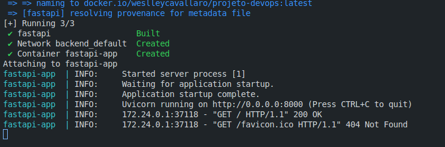
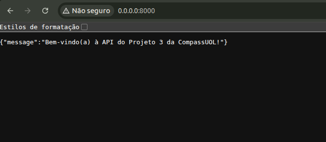
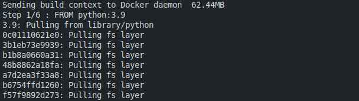
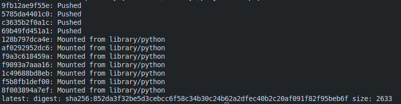
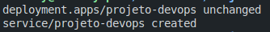
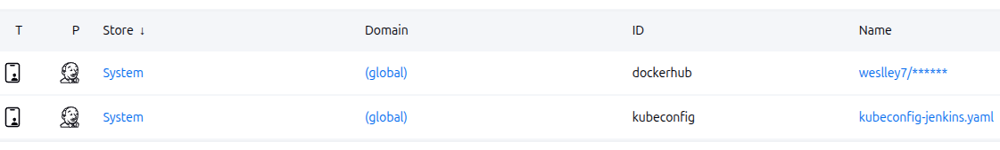
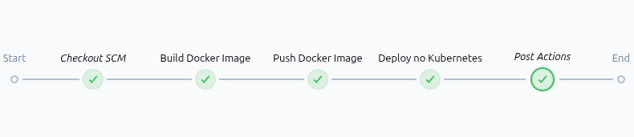
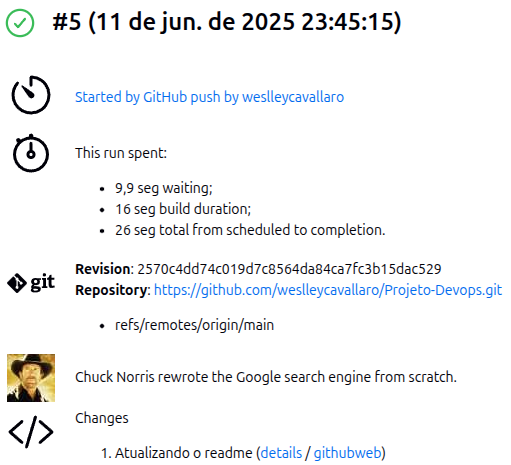

# 🚀 Projeto DevOps - Backend FastAPI com CI/CD Kubernetes

<div style="display: flex; justify-content: space-between; width: 100%;">
  
  
  
  
  
</div>

## 📄 Visão Geral

Este projeto implementa um ciclo completo de DevOps para uma aplicação backend FastAPI, contemplando as etapas de desenvolvimento, conteinerização com Docker, versionamento com Git, build e deploy automatizado via Jenkins com deploy final no cluster Kubernetes local.

## 🛠️ Tecnologias Utilizadas

* Versionamento de Código: GitHub
* Linguagem: Python + FastAPI
* Container Runtime: Docker
* Registry de Imagens: Docker Hub
* Pipeline CI/CD: Jenkins
* Orquestração de Container: Kubernetes (Minikube local)

## 🗂️ Fase 1 - Preparação do Projeto

### Atividades

* Criação do repositório no GitHub
* Criação da conta no Docker Hub
* Configuração do cluster Kubernetes local (Minikube)
* Validação local da aplicação com Uvicorn

### 💻 Execução Local

### Estando na pasta do projeto /backend:

* Criação do ambiente virtual:

  ```
  python -m venv venv
  ```
* Ativação do ambiente:

  ```
  source venv/bin/activate
  ```
* Instalação das dependências:

  ```
  pip install requirements.txt
  ```

* Execução local:

  ```
  uvicorn main:app --reload
  ```

  

* Acesso:

  ```
  http://0.0.0.0:8000
  ```

  


## 🐳 Fase 2 - Conteinerização com Docker

### A partir do dockerfile criado:

### 🔨 Build da Imagem

```
 docker build -t usuario/projeto-devops:latest .
```




### 🔬 Teste Local

```
docker run -d -p 8000:8000 usuario/projeto-devops:latest
```

ou

```
docker compose up --build
```


### 📤 Publicação no Docker Hub

```
docker login
```

```
docker push usuario/projeto-devops:latest
```



## ☸️ Fase 3 - Deploy Manual no Kubernetes

### Deployment (deployment.yaml)

### 🔗 Aplicação no Cluster

```
kubectl apply -f deployment.yaml
```



### Acesso via NodePort

```
http://localhost:30001
```


## 🔄 Fase 4 - CI/CD Completo com Jenkins (Build, Push e Deploy)

### Pré-requisitos no Jenkins

* Jenkins com Docker, kubectl e kubeconfig configurados, rodando em:

  ```
  http://localhost:8080
  ```

* 🔐 Credenciais do Docker Hub armazenadas no Jenkins (dockerhub-credentials)



* Expor a API local do Jenkins via Ngrok

  ```
  ngrok http http://localhost:8080
  ```

* 🪝 Webhook GitHub configurado apontando para:

  ```
  http://ngrok_url/github-webhook/
  ```

* Slack configurado para receber solicitações HTTP através do webhook

### Jenkinsfile

### 🔁 Fluxo Completo da Pipeline



1. Git push no GitHub.
2. Webhook aciona o Jenkins.
3. Jenkins realiza o build da imagem Docker.
4. Jenkins realiza o push da imagem para o Docker Hub.
5. Trivy realiza o scan da imagem.
6. Jenkins aplica o deploy no cluster Kubernetes.
7. Chuck Norris da seu veredito final..



## 🎯 Entrega Final Finais

* Código versionado no GitHub
* Imagem publicada no Docker Hub
* Aplicação rodando no Kubernetes via NodePort
* Pipeline Jenkins automatizada com CI/CD completo